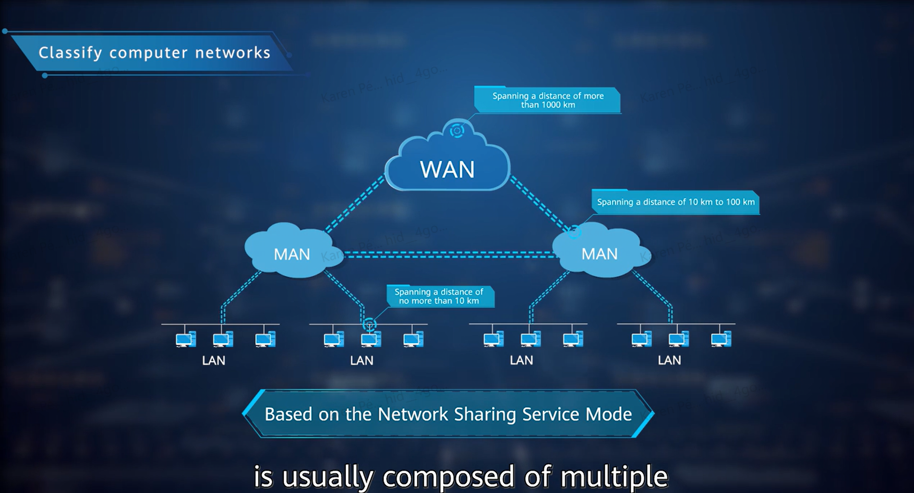
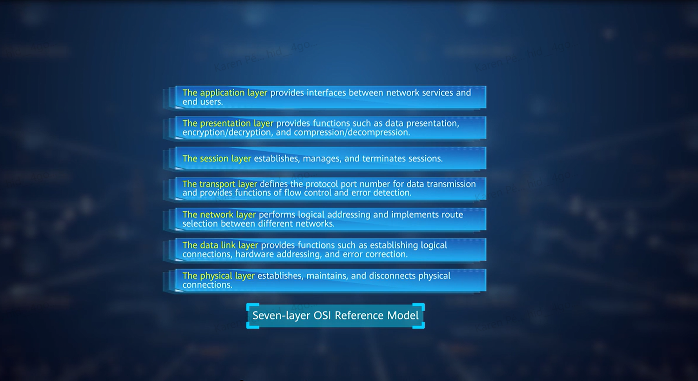
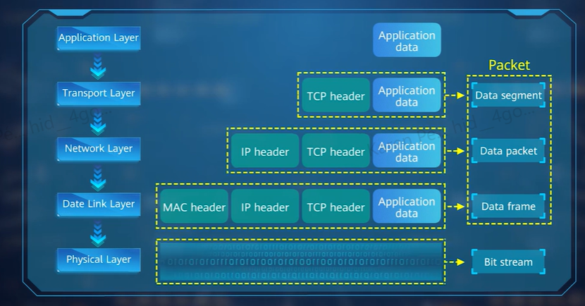

<h1 align="center">📘 1. Básicos de Redes de Computadoras</h1>

<p align="center">
  <em>Conceptos fundamentales, clasificación de redes, arquitectura y modelos de referencia OSI e Internet.</em>
</p>

---

## 📌 Overview

> Esta sección describe los conceptos básicos, clasificación, arquitectura y los procesos de encapsulación de datos utilizados en las redes de computadoras.

---

## 🌐 Clasificación de Redes


| Tipo de red | Alcance aproximado | Descripción |
|-------------|--------------------|-------------|
| **LAN** (Local Area Network) | Hasta 10 km | Red de área local, conecta dispositivos dentro de un edificio o campus. |
| **MAN** (Metropolitan Area Network) | 10 km a 100 km | Red de área metropolitana, conecta varias LANs en una ciudad. |
| **WAN** (Wide Area Network) | Más de 100 km | Red de área amplia, conecta redes a nivel nacional o mundial. |

---

## 🧱 Modelo de Referencia OSI (7 capas)



| **Capa** | **Nombre**          | **Función principal (Huawei)**                                                                                                      |
|---------:|---------------------|--------------------------------------------------------------------------------------------------------------------------------------|
| **7**    | Aplicación           | Interfaz entre usuario y red (ej. HTTP, FTP, Telnet). No proporciona servicios de red directamente, sino que usa protocolos.        |
| **6**    | Presentación         | Conversión de formato de datos, cifrado (ej. SSL/TLS), compresión. Huawei la menciona como parte del software del host.             |
| **5**    | Sesión               | Establece, mantiene y termina sesiones (ej. SSH, RPC). Poca implementación directa en equipos Huawei.                               |
| **4**    | Transporte           | Control de flujo y confiabilidad (ej. TCP, UDP). Routers Huawei identifican puertos para reglas de firewall, NAT, QoS.              |
| **3**    | Red                  | Enrutamiento entre redes (ej. IP, ICMP, OSPF). Los **routers Huawei operan fuertemente aquí**.                                      |
| **2**    | Enlace de datos      | Dirección MAC, control de errores, control de acceso al medio (ej. Ethernet, PPP). **Switches Huawei funcionan en esta capa**.      |
| **1**    | Física               | Transmisión de bits (medios físicos como cobre, fibra). Huawei gestiona esta capa con interfaces como GE, 10GE, etc.                |

---

## 🌐 Modelo de Referencia de Internet (5 capas)

| Capa | Equivalencia OSI | Función |
|------|------------------|---------|
| Aplicación | Capas 5, 6 y 7 | Servicios a la aplicación del usuario |
| Transporte | Capa 4 | Comunicación extremo a extremo |
| Internet | Capa 3 | Direccionamiento IP y enrutamiento |
| Enlace de datos | Capa 2 | Acceso al medio y direccionamiento físico |
| Física | Capa 1 | Transmisión de bits |

---

## 🔄 Proceso de Encapsulación de Datos



# 🛰️ Encapsulación y Desencapsulación

 Cada capa **añade su propio encabezado** al enviar, y lo **elimina al recibir**.

---

## 📦 Proceso de Encapsulación (Envio)
| Capa OSI     | Acción                                                                                     |
|--------------|---------------------------------------------------------------------------------------------|
| **Capa 7-5** | Aplicación genera los datos. Ejemplo: petición HTTP o archivo por FTP.                     |
| **Capa 4**   | Se agregan los encabezados TCP/UDP con puertos y control de errores.                       |
| **Capa 3**   | Se añaden las direcciones IP (origen y destino) y otros datos de enrutamiento.             |
| **Capa 2**   | Se agregan las direcciones MAC y el CRC (control de errores de capa 2).                    |
| **Capa 1**   | Todo se convierte en una **señal física** (eléctrica, óptica o de radiofrecuencia).        |

✅ **Resultado**: un **frame** listo para transmitirse.

---

## 📥 Proceso de Desencapsulación (Recepción)
| Capa OSI     | Acción                                                                                     |
|--------------|---------------------------------------------------------------------------------------------|
| **Capa 1**   | El receptor capta las señales físicas y las convierte en bits.                             |
| **Capa 2**   | Verifica la dirección MAC destino y extrae los datos del frame.                            |
| **Capa 3**   | Comprueba si la IP destino coincide y pasa al siguiente salto o al host final.             |
| **Capa 4**   | Verifica el número de puerto y reconstruye los segmentos.                                  |
| **Capa 7-5** | El usuario recibe los datos. Ejemplo: el navegador muestra la página web solicitada.       |

---

## 🧱 Encapsulación

| Capa OSI          | Datos / Encabezado añadidos                                    | Unidad resultante    |
|-------------------|----------------------------------------------------------------|-----------------------|
| Application Layer | Application data                                               |                       |
| Transport Layer   | TCP header + Application data                                  | **Data segment**      |
| Network Layer     | IP header + TCP header + Application data                      | **Data packet**       |
| Data Link Layer   | MAC header + IP header + TCP header + Application data         | **Data frame**        |
| Physical Layer    | Bit stream (señal física del frame)                            | **Bit stream**        |

---

## 📶 Puntos clave 

- **Capa 3 (Red)**: Protocolos de enrutamiento como OSPF, BGP.
- **Capa 2 (Enlace de datos)**: Control de acceso al medio (MAC), importante en switches y Wi-Fi.
- **Capa 1 (Física)**: Gestión de interfaces (ej. GE, 10GE, SFP).
- El **modelo OSI se usa para diagnóstico**. Ejemplo:
  - Si el ping funciona (capa 3), pero no puedes abrir una web (capa 7), el problema está entre la capa 4 y 7.

---

## 🧪 Ejemplo práctico: Envío de archivo por FTP

1. Aplicación crea el archivo.
2. TCP divide el archivo en segmentos y los numera.
3. IP define la ruta (agrega encabezado de red).
4. Ethernet lo empaqueta con dirección MAC.
5. Se transmite como señales por el medio físico (fibra, cobre, etc).
6. Switch reenvía el frame al router.
7. Router consulta su tabla de rutas y lo envía al siguiente salto.
8. El receptor desencapsula cada capa y reconstruye el archivo.

---


```plaintext
Aplicación -> Presentación -> Sesión -> Transporte -> Red -> Enlace de Datos -> Física
